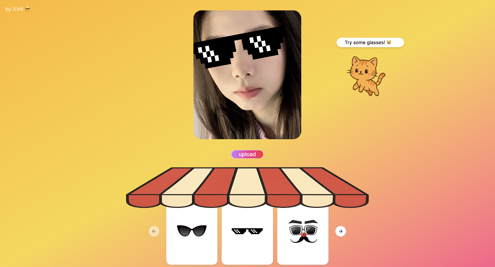

# ✨ Try It On! 🕶️

A fun, interactive accessory try-on web app where users can upload their photo and see what they look like with different glasses and props — all wrapped in a cute, shop-like UI featuring a flying cat mascot. 🐱🌈

## 🎯 Features

- 📸 Upload your own selfie
- 😎 Try on various accessories (sunglasses, hats, etc.)
- 🛍️ Animated storefront design with a canopy and carousel
- 🐾 Cute flying cat mascot
- 🌇 Fully responsive UI with gradient background
- 💡 Built with React + Tailwind CSS

## 📸 Screenshot



## 🚀 Getting Started

### 1. Clone the repo

```
git clone https://github.com/ShirleyXW/WearWise.git
```

### 2. Install dependencies
```
npm install
```
### 3. Run the app (locally)
In two separate terminals:  
#### Terminal 1 – start backend (FastAPI)
```
cd backend
uvicorn main:app --reload
```
#### Terminal 2 – start frontend (React)
```
cd frontend
npm install
npm run dev
```
## 🛠️ Tech Stack
- Frontend: React + Tailwind CSS
- Animation: Framer Motion + Tailwind animate utilities
- State Management: React Hooks
- Image Handling: <input type="file" /> with preview
- Backend: FastAPI
- AI Model: Custom-trained Object Detection model, hosted on Hugging Face

## 💡 Inspiration
Created as a playful portfolio project to explore:

✨ UI animation and visual delight

🧩 Accessory overlay logic using bounding boxes

😽 Whimsical cartoon-style character design

🤖 Integration of a custom-trained object detection AI model

☁️ AI model hosting & API inference via Hugging Face


## 🧑‍🎨 Author
Xinli Wang